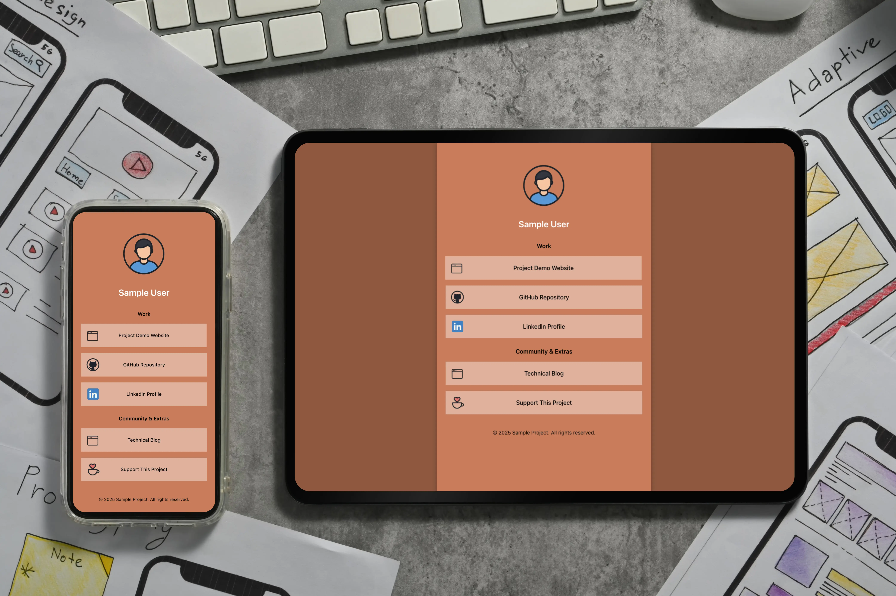

# 🌐 Links Component — Next.js + Framer Motion

A **standalone and reusable component** for displaying animated link sections in any Next.js project.  
Perfect for **portfolios, personal sites, and developer homepages**. Bring your links to life with smooth animations and a clean design.

---

## 🚀 Features

- Smooth animations with **Framer Motion**
- Fully **mobile responsive**
- Easy to **customize** and extend
- Organize links into multiple **sections**
- Optional **profile avatar**
- Styled with **CSS Modules**
- **Plug‑and‑play** for any Next.js project

---

## 📦 Installation

1. Clone the repository:

```bash
git clone https://github.com/ewigdev/links.git
```

2. Navigate into the project:

```bash
cd links
```

3. Install dependencies:

```bash
npm install
```

4. Make sure **Framer Motion** is installed:

```bash
npm install framer-motion
```

---

## 🧩 Usage

1. Copy the component folder into your Next.js project:

```
/src/components/LinksComponent
```

2. Import and use it anywhere in your app:

```jsx
import LinksComponent from "@/components/LinksComponent/LinksComponent";

export default function Page() {
  return <LinksComponent />;
}
```

---

## 🎨 Customization

### Modify link sections

Edit the sections directly in `LinksComponent.jsx`:

```jsx
const linkSections = [
  {
    section: "Work",
    links: [
      {
        title: "Demo Website",
        href: "https://example.com",
        img: "/assets/links/sample.webp",
      },
    ],
  },
];
```

### Update assets

- Link icons: `/public/assets/links/`
- Avatar image: `/public/assets/avatar-placeholder.png`

---

## 🗂 Recommended Project Structure

```
/src
 └── /components
      └── /LinksComponent
           ├── LinksComponent.jsx
           ├── Links.module.css
/public
 └── /assets
      ├── avatar-placeholder.webp
      └── /links
          ├── sample-site.webp
          ├── sample-github.webp
          ├── sample-support.webp
          └── sample-blog.webp
README.md
package.json
```

---

## 🎬 Live Demo

See the component in action:



Or check it live in my portfolio: [Ewig Dev Links Page](https://ewigdev.tokyo/links)

---

## 📝 License

MIT License — free to use, modify, and distribute.

---

## ❤️ Author

**Cris Alarcon** — Created as a reusable component for portfolio and web projects.  
Check out the live version in my portfolio: [Ewig Dev Links Page](https://ewigdev.tokyo/links)

